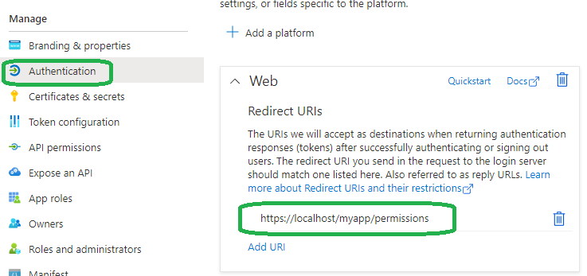
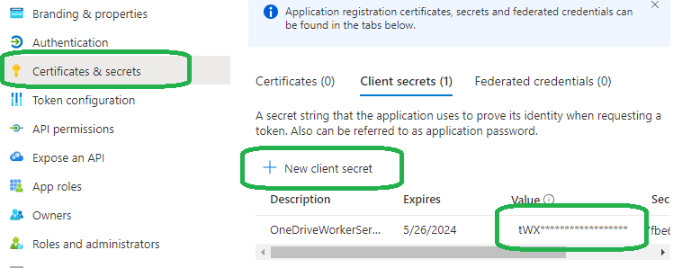
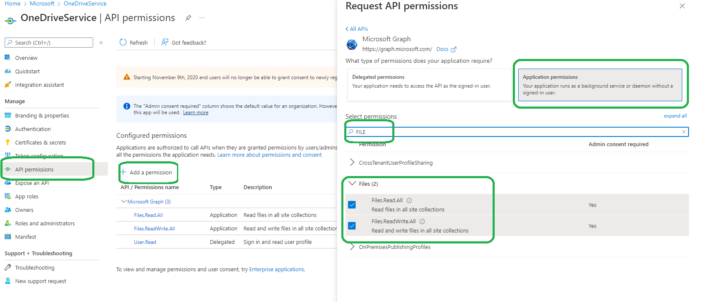

# Call OneDrive as a service (ClientSecret flow)

This is a demo code for video [Graph APIs: Upload large file w/ progress to OneDrive, use of special folder & more | CodeNameK - 04](https://www.youtube.com/watch?v=yuoAWP3wn80).

[kiquenet kiquenet](https://www.youtube.com/channel/UCZFfJ2gG_C8__esaCVhn_QA) raised the question:

> I need create Windows Service, NOT InteractiveBrowser for access to shared folder in our OneDrive company. The folder is shared with a external client.
> External client upload and download files from/to our ONe Drive.
> Our Windows service requires upload and download files from/to our OneDrive.
> Not interactive process requires. How-to authenticated?

Here's example code. Note, I can't verify end to end because my account doesn't have an SharePoint Online (SPO) license with it. And you will also have to have an SPO license to make it work.

Here's the walk-through

## Register the app

1. Go to <https://aka.ms/AppRegistrations> to register an app if you don't have it already.
1. Add an authentication endpoint for `web`, it will be used by admin consent step later later.

    

1. Add a client secret

    

    Copy the secret now and save it. Once you leave the page, you can't copy it again.

1. Add API Permissions

    

    * Do NOT choose delegated permission, use `application permissions` instead to grant permission to the application.

Now the registration is ready.

## Manually consent for once

The tenant admin need to consent the permissions. Paste this URL template into any browser:

```shell
https://login.microsoftonline.com/{tenantId}/adminconsent?client_id={clientId}&state=12345&redirect_uri=https://localhost/myapp/permissions
```

* You can get the `tenant id` & `client id` from the overview page of the registered app. They are displayed as `Directory (tenant) ID` & `Application (client) ID`.
* state could be anything. It will be post back to you when the consent is done.
* The `redirect_uri` need to match one of the Web endpoint you created earlier.

## Write the code

Code is relative simple:

```csharp
TokenCredential tokenCredential = new ClientSecretCredential(
    tenantId: "your-tenant-id",
    clientId: "your-client-id",
    clientSecret: "the-client-secret"
);

GraphServiceClient client = new GraphServiceClient(tokenCredential, Scopes);
ListItem result = await client.Drive.Root.ListItem.Request().GetAsync(stoppingToken);
```

For a complete example, refer to [Worker.cs](./Worker.cs).

These are the packages needed, also in [OneDrive-Sample-Worker-Service.csproj](./OneDrive-Sample-Worker-Service.csproj):

```xml
    <PackageReference Include="Azure.Identity" Version="1.6.0" />
    <PackageReference Include="Microsoft.Graph" Version="4.29.0" />
```

## Reference

* [Get access without a user](https://docs.microsoft.com/en-us/graph/auth-v2-service)